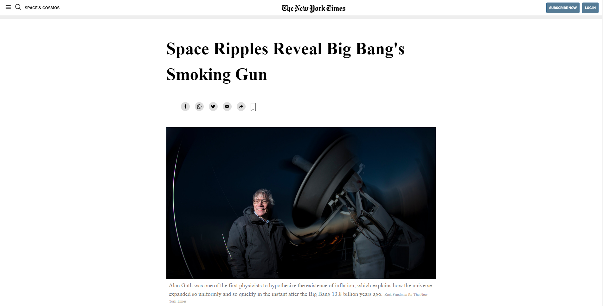

# New York Times clone

> The project is to learn more about Positioning and floating elements applied cloning a New York Times blog.

I've included the entire article, the navbar, the footer adn I've use different types to positioning and floating elements.
Flexbox, GRID and Float were used.

## Built With 🔨

- HTML5
- CSS
- Visual Studio Code
- Git & Github

## Live Demo 👀

[Live Demo Link](https://livedemo.com)

## Getting Started

**- Just clone this repository to modify or improve yourself.**
**Modify this file to match your project, remove sections that don't apply. For example: delete the testing section if the currect project doesn't require testing.**

To get a local copy up and running follow these simple example steps.

### Prerequisites

- IDE to edit and run the code (I've used Visual Studio Code 🔥).

### Usage

- For anyone who wants to practice HTML5 and CSS.
- Check out how floating and positioning elements using GRID, Flexbox and Float.

## Author:

👤 **Dante Alonso**

- GitHub: [@GithubHandle](https://github.com/DanteAlonsoHT)
- Twitter: [@TwitterHandle](https://twitter.com/dante_dante1)
- LinkedIn: [LinkedIn](https://www.linkedin.com/in/dante-hernandez99/)

## 🤝 Contributing 🔧

Contributions, issues, and feature requests are welcome!

Feel free to check the [issues page](../../issues/).

## Show your support

Give a ⭐️ if you like this project! :)

## Acknowledgments

- Hat tip to anyone whose code was used 🔰
- Inspiration 💘
- Microverse program ⚡
- My standup team 🏹

## 📝 License

This project is [MIT](./MIT.md) licensed.
